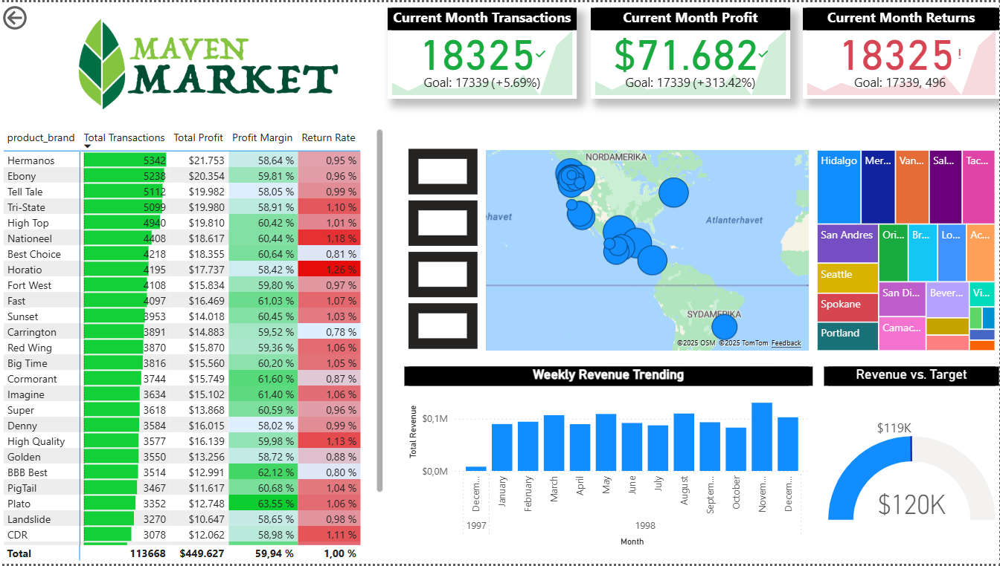

#Welcome to my PowerBI Dashboard repository!

Overview:
The Mavern Market powerBI report provides an interactive overview of company revenue performance. 
It tracks total revenue against targets, analyzes year-to-date (YTD) growth, and visualizes key KPIs such as revenue trends, weekend performance, and monthly progress toward goals. 
The dashboard is fully interactive — users can filter by month, region, or product to explore performance insights.

How to Open:
Download all files in this repository
Save the files in a suitable location on your computer 
Open the pbix file in Power BI Desktop
If prompted, update the data source to the local /data/ folder
Click Refresh to load the CSV data files and explore the visuals interactively

Highlights:

Preview:

